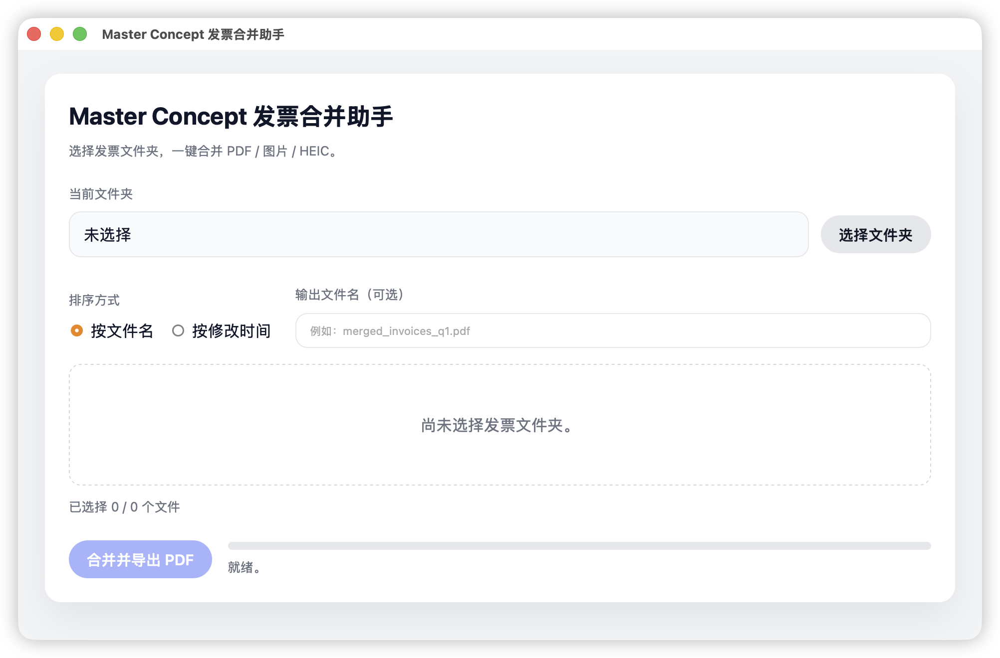

# Invoice Merge Assistant

Invoice Merge Assistant is a lightweight cross-platform desktop tool built with React, TypeScript, and Tauri. It focuses on one workflow: taking a folder full of invoice PDFs or images (JPG/PNG/HEIC) and producing a single clean PDF bundle—ideal for expense reports, finance audits, and archival. Everything stays local, so sensitive data never leaves your machine.



## Key Features

- **Folder-first workflow**: Select any directory; the app auto-detects supported files, shows metadata, and keeps the original order sorted by name or modified time.
- **Selective merging**: Use the list checkboxes to include/exclude files before running a merge.
- **Local conversions**: Images (including HEIC) are rasterized into A4 pages, while PDFs are appended directly.
- **Progress + feedback**: See stages (scan/convert/merge/write) and receive a summary dialog with failure counts.

## Getting Started

1. Install dependencies: `npm install`
2. Run in development:
   ```bash
   npm run tauri dev
   ```
3. Build production bundles (macOS/Windows/Linux packages):
   ```bash
   npm run tauri build
   ```

Rust tooling (stable) and the Tauri prerequisites for your platform must be installed. For HEIC conversion support, ensure system codecs are available (macOS ships them by default).

## Repository Layout

- `src/`: React UI (Vite) components, styles, and hooks
- `src-tauri/`: Rust backend commands, merge pipeline, and bundler config
- `docs/`: Product/design/technical briefs and UI snapshots
- `AGENTS.md`: Contributor guidelines

## Contributing

See `AGENTS.md` for coding style, testing, and PR expectations. Issues and PRs are welcome—especially around expanding file-format support, accessibility improvements, and additional progress telemetry.
